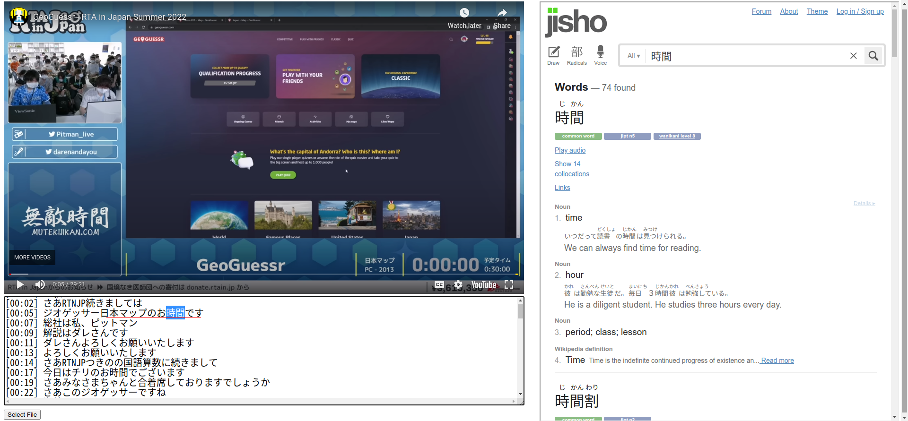
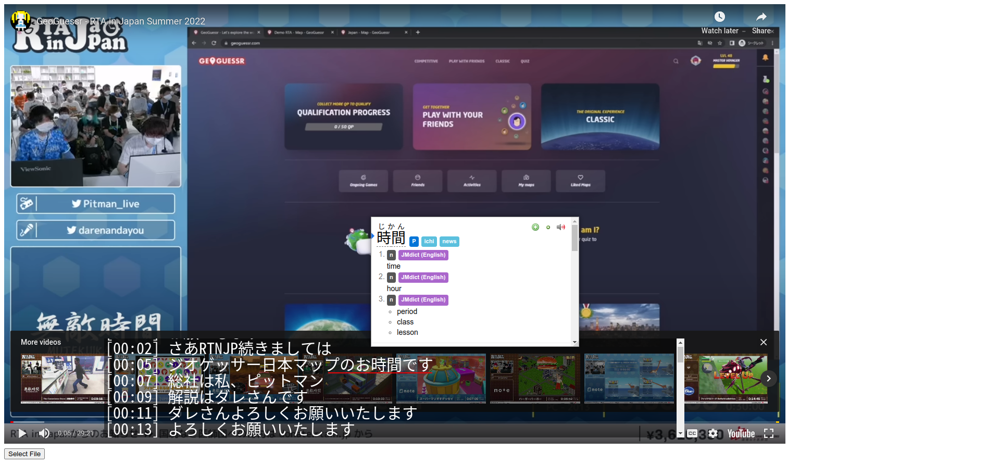

# Japanese Transcript Reader

When learning a new language, one of the best methods is *immersion*: absorbing and interacting with content in that language. A great way to do this is by watching videos in the target language. Additionally, studies have shown that subtitle in the native language hurt language acquisition, but subtitles in the *target* language actually improves acquisition.

I designed this application based on two principles:

* The auto-generated Japanese subtitles on YouTube lack accuracy.
* Allow the user to lookup the definition of a word without interrupting the flow of the video

### Accurate Japanese subtitles

For extracting high accuracy subtitles, I use OpenAI's Whisper in a Jupyter notebook. The resulting transcript is copy-pasted into a text file for processing by the application.

### Lookup word definitions

Originally, I programmed a system where by highlighting and right clicking a word, it would do a search for the selected text with Jisho, an online Japanese dictionary, in an iFrame to the right of the video. Then, I discovered the [Yomichan](https://chrome.google.com/webstore/detail/yomichan/ogmnaimimemjmbakcfefmnahgdfhfami) browser extension, which has a more limited but similar functionality. However, Yomichan integrates seamlessly with [Anki](https://apps.ankiweb.net/), a flashcard system, to automatically create flashcards of newly learned vocab. Compare the before and after below. By removing the side panel, I was able to increase the size of the video player and position the transcript over top, making it easier to follow along.

### Additional features

The transcript is located in a text box, which will automatically scroll to match the current timestamp of the video. In addition, a red line underlines the approximate current timestamp, which helps draw the eye to the correct point within a line of transcribed text.

### Setup

One issue I ran into is that browser extensions are not enabled on local html files (file://) by default, which prevented Yomichan from working, so I had to enable that in Chrome.
